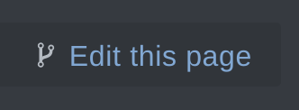
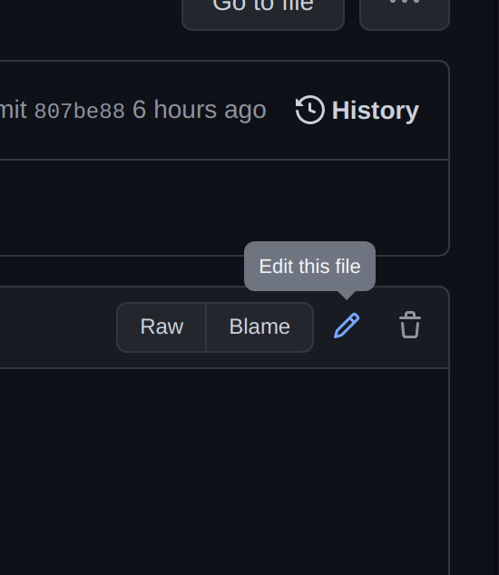
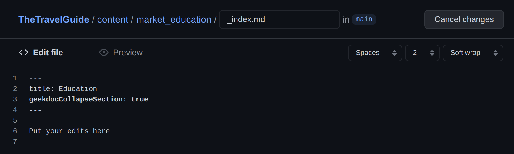
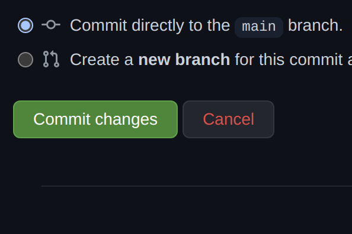

---
resources:
  - name: commit_button
    src: "commit_button.png"
    title: Commit Button
  - name: edit_button
    src: "edit_button.png"
    title: Edit Button
  - name: edits
    src: "edits.png"
    title: Example of Editing a File
  - name: edit_this_file
    src: "edit_this_file.png"
    title: Edit Button
weight: 10
title: How to Edit with a Web Browser
---

To edit a page through a web browser, follow these steps:

1. Navigate to the page you would like to edit.
2. Click the "Edit this page" button at the top right of the page. 

   

   This will take you to the GitHub repository, where you will see the file that contains the page you wish to edit. To make changes, click the "Edit this file" button in the top right corner. If you don't have a GitHub account, you can create one at the login prompt.

   

3. Make your edits in the file as shown below. Refer to the [Geekdocs Demo Site](https://geekdocs.de/usage/getting-started/) for guidance on including pictures, equations, code blocks, columns, hints, and more.

   

4. Once you have finished editing the file, scroll down and click the "Commit" button at the bottom of the page.

   

That's it! The maintainers will review your contribution, and once approved, it will go live.
